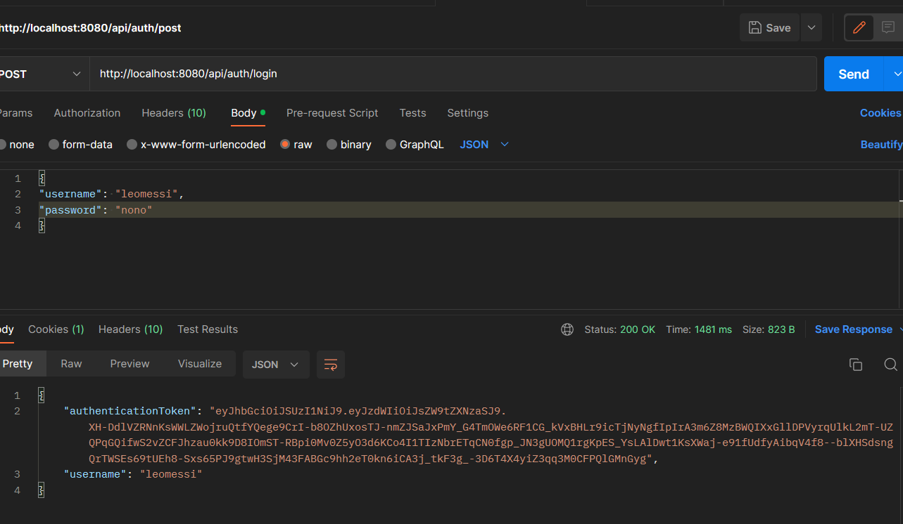
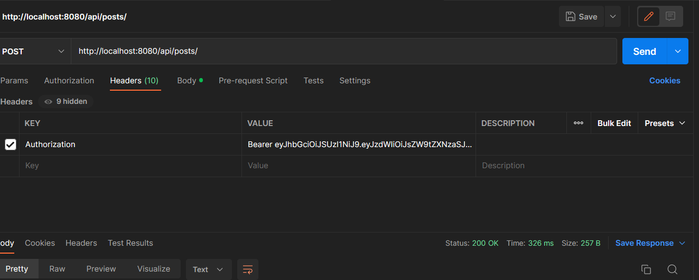

mettre à jour les depandances maven dans le pom.xml
Créer une base de données "bdd_blog_sb" dans votre mysql

Inscription utilisateur
http://localhost:8080/api/auth/signup
{
"firstname": "leo",
"lastname": "messi",
"username": "leomessi",
"password": "nono",
"email": "lol"
}

Connexion utilisateur
{
"username": "leomessi",
"password": "nono",
}

une fois l'utilisateur connecté on lui génére le token

Insert le post
http://localhost:8080/api/posts/
{
"content": "blog test",
"title": "toto"
}

ici c'est l'autorisation avec le jwt

Recupere tout les articles
http://localhost:8080/api/posts/all

Recupere l'article selon l'id, ici c'est l'id 1
http://localhost:8080/api/posts/get/1